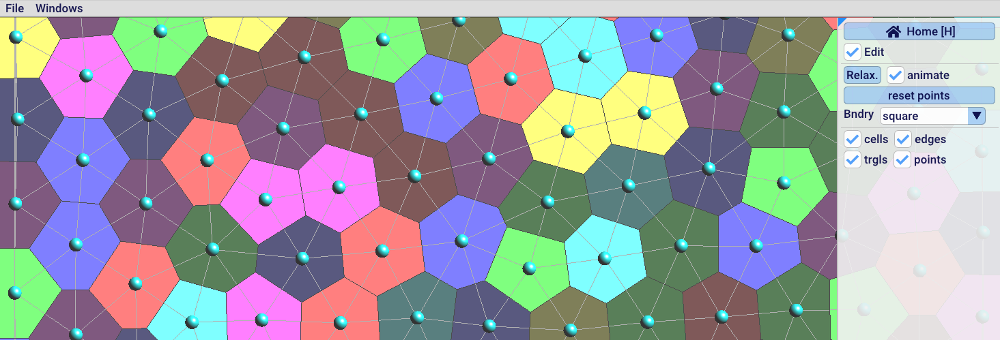
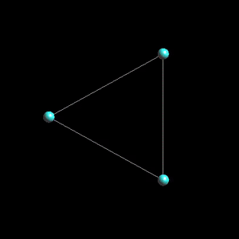

# 2D Delaunay triangulations and Voronoi diagram



The [example program](https://github.com/BrunoLevy/geogram/blob/main/src/examples/graphics/demo_Delaunay2d/main.cpp) 
computes a 2D Delaunay triangulation and the dual Voronoi diagram. Try
it [online](https://members.loria.fr/Bruno.Levy/GEOGRAM/geogram_demo_Delaunay2d.html).
The computed structures are displayed and can be interactively modified.
The pointset can be optimized by Lloyd relaxation.

The Delaunay class
------------------

```c++
Delaunay_var delaunay = new Delaunay2d()
```

where `Delaunay_var` is a typedef corresponding to `SmartPointer<Delaunay>`.
The delaunay triangulation is computed by the following function:
```c++
delaunay->set_vertices(n, points);
```
where `n` denotes the number of points and where `points` is a pointer
to a contiguous array of 2n double precision numbers with the
coordinates of the points. If the point coordinates are stored in a
`std::vector<double>`, one may use 
`delaunay->set_vertices(v.size()/2, v.data())`. If the point coordinates
are stored in a `std::vector<vec2>`, one may use
`delaunay->set_vertices(v.size(), &v.data()->x)` (as in the demo program).
Using `double*` as an interface may seem low-level / outdated, but it is
the smallest common denominator, and makes it easier to use with your
own data structures. 

Once the triangulation is created, it can be accessed through the
following functions:

- `Delaunay::nb_vertices()` returns the number of vertices (as specified in `set_vertices()`)
- `Delaunay::nb_cells()` returns the number of cells (in our case triangles) in the triangulation.
- `Delaunay::cell_vertex(c,lv)` where `0 <= c < nb_cells()` and `lv` in `{0,1,2}`, returns a vertex of a triangle
- `Delaunay::cell_adjacent(c,lf)` where `0 <= c < nb_cells()` and `lf` in `{0,1,2}`, returns the triangle adjacent to `c` accross
edge `lf`
- `Delaunay::vertex_ptr(v)` where `0 <= v < nb_vertices()` returns a pointer to the coordinates of the `v`-th vertex.

Alternatively, one may use the (lower-level) functions:

- `Delaunay::cell_to_v()` returns a pointer to the cell-vertices incidence array.
- `Delaunay::cell_to_cell()` returns a pointer to the cell-cell adjacency array.


Drawing the Delaunay triangulation and the Voronoi diagram
----------------------------------------------------------




We shall now see how to visualize the Delaunay triangulation and its
dual, the Voronoi diagram. Geogram provides a set of classes 

To draw things on the screen, Geogram has a
set of functions called `GLUP`, declared in
[this header file](https://github.com/BrunoLevy/geogram/blob/main/src/lib/geogram_gfx/GLUP/GLUP.h).
The vertices are drawn as follows:

```c++
  glupBegin(GLUP_POINTS);
  for(index_t i=0; i<points_.size(); ++i) {
    glupVertex(points_[i]);
  }
  glupEnd();
```
Each call to `glupVertex()` between `glupBegin(GLUP_POINTS)` and `glupEnd()`
results in a little ball drawn on the screen. In addition, one can specify
the size (`glupSetPointSize()`) and the color (`glupSetColor3f()`) of the
points. Programmers who know the (old) OpenGL 2.x API will feel "at home":
GLUP takes exactly the same convention. Under the hood, GLUP "translates"
its call into modern OpenGL (with vertex buffers and shaders). 


The triangles are drawn as follows:
```c++
  glupBegin(GLUP_LINES);
  for(index_t c=0; c<delaunay_->nb_cells(); ++c) {
    const signed_index_t* cell = delaunay_->cell_to_v() + 3*c;
    for(index_t e=0; e<3; ++e) {
      signed_index_t v1 = cell[e];
      signed_index_t v2 = cell[(e+1)%3];
      glupVertex2dv(delaunay_->vertex_ptr(index_t(v1)));
      glupVertex2dv(delaunay_->vertex_ptr(index_t(v2)));
    }
  }
  glupEnd();
```
Each pair of calls to `glupVertex()` between `glupBegin(GLUP_LINES)`
and `glupEnd()` results in a segment drawn on the screen.

Let us now see how to draw the Voronoi cells. It is slightly more complicated, because
they are not represented explicitly. What we need to do is deducing them "on the fly"
from the Delaunay triangulation.

The vertices of the Voronoi cell corresponds to the circumcenters of the Delaunay triangles,
let us write a function to compute them:
```c++
  vec2 circumcenter(index_t t) {
     signed_index_t v1 = delaunay_->cell_to_v()[3*t];
     signed_index_t v2 = delaunay_->cell_to_v()[3*t+1];
     signed_index_t v3 = delaunay_->cell_to_v()[3*t+2];
     vec2 p1(delaunay_->vertex_ptr(index_t(v1)));
     vec2 p2(delaunay_->vertex_ptr(index_t(v2)));
     vec2 p3(delaunay_->vertex_ptr(index_t(v3)));
     return Geom::triangle_circumcenter(p1,p2,p3);
  }
```
It uses the function `triangle_circumcenter()` declared in `geogram/basic/geometry.h`.

Now we can write a function that computes the Voronoi cell associated with a vertex, from
the Delaunay triangulation. Using `typedef vector<vec2> Polygon`, the function looks like
that:
```c++
  void get_Voronoi_cell_v1(index_t t0, index_t lv, Polygon& cell) {
      cell.resize(0);
      index_t v = index_t(delaunay_->cell_to_v()[3*t0+lv]);
      index_t t = t0;
      do {
	 index_t e = (lv+1)%3;
	 signed_index_t neigh_t = delaunay_->cell_to_cell()[3*t+e];
	 cell.push_back(circumcenter(t));
	 t = index_t(neigh_t);
	 lv = find_vertex(t,v);
      } while(t != t0);
  }
```

It takes as an argument a triangle `t0`, a local vertex index `lv in {0,1,2}`
and fills the polygon `cell` with the Voronoi cell associated with vertex `lv`
of triangle `t0` (let us call it `v`). It traverses the triangles incident to `v`
until it reaches `t0` again. For each triangle, one needs to find the local index
of `v` in it, using the `find_vertex()` function that works as follows:

```c++
  index_t find_vertex(index_t t, index_t v) {
     for(index_t lv=0; lv<3; ++lv) {
         if(index_t(delaunay_->cell_to_v()[3*t+lv]) == v) {
            return lv;
         }
     }
     geo_assert_not_reached;
  }
```
Note the `geo_assert_not_reached` statement, that will detect at runtime whenever you give to the
function and triangle and a vertex the triangle is not incident to. It is a good practice to insert
some assertion checks in your code, can save you *hours* of debugging.

So we are done for the Voronoi cells ? Not exactly in fact, because if you look at the Delaunay
triangulation, then clearly it has a boundary (that corresponds to the convex hull of the vertices),
and vertices on the boundary are associated with infinite Voronoi cells, so how can we compute those ?
Our function that computes the Voronoi cells needs
to be slightly more complicatd (hence the `_v1` suffix in the previous version).

```c++
void get_Voronoi_cell(index_t t0, index_t lv, Polygon& cell) {
    cell.resize(0);
    index_t v = index_t(delaunay_->cell_to_v()[3*t0+lv]);
    bool on_border = false;
    index_t t = t0;
	    
    do {
	index_t e = (lv+1)%3;
	signed_index_t neigh_t = delaunay_->cell_to_cell()[3*t+e];
	if(neigh_t == -1) {
	    on_border = true;
	    break;
	}
	cell.push_back(circumcenter(t));
	t = index_t(neigh_t);
	lv = find_vertex(t,v);
    } while(t != t0);
	    
        
    // If one traversed edge is on the border of the convex hull, then
    // we empty the cell, and start turing around the vertex in
    // the other direction, i.e. by traversing this time
    // edge (lv+2)%3 until we reach the other edge on the border of
    // the convex hull that is incident to v.
    if(on_border) {
	cell.resize(0);
	cell.push_back(infinite_vertex(t,(lv + 1)%3));
	for(;;) {
	    cell.push_back(circumcenter(t));                
	    index_t e = (lv+2)%3;
	    signed_index_t neigh_t = delaunay_->cell_to_cell()[3*t+e];
	    if(neigh_t == -1) {
		cell.push_back(infinite_vertex(t, e));
		break;
	    }
	    t = index_t(neigh_t);
	    lv = find_vertex(t,v);
	}
    }
}
```

As before, we turn around the vertex, and insert the triangle circumcenters. But this time, we take care
of detecting the triangles on the convex hull. If we detect one, we restart the computation (clear the
polygon computed so far). Each triangle edge on the convex hull is associated with a vertex at infinity.
In our case, we just put it "far far away", using the function `infinite_vertex()` below. For each vertex
on the convex hull, there will be two of them, at the beginning and at the end of the traversal. 

```c++
vec2 infinite_vertex(index_t t, index_t e) {
    index_t lv1 = (e+1)%3;
    index_t lv2 = (e+2)%3;
    index_t v1 = index_t(delaunay_->cell_to_v()[3*t+lv1]);
    index_t v2 = index_t(delaunay_->cell_to_v()[3*t+lv2]);
    vec2 p1(delaunay_->vertex_ptr(v1));
    vec2 p2(delaunay_->vertex_ptr(v2));
    vec2 n = normalize(p2-p1);
    n = vec2(n.y, -n.x);
    return 0.5*(p1+p2)+100000.0*n;
}
```

Convex clipping
---------------

Equipped with these functions, we can display the Voronoi cells. But
we would like to do more: when we fill the Voronoi cells, those which
have vertices at the infinity (or far far away) will be naturally
clipped by the border of the drawing window, but can we clip them with
a smaller rectangle ? Or can we clip them with an arbitrary shape ? In
fact, it is interseting to ask the question not only for aesthetic
reasons, but also because we want to compute something called a
_centroidal Voronoi diagram_, that is, what ones obtains by moving
each point to the centroid of its Voronoi cell over and over. It is
possible to prove that doing so minimizes an objective function (that
corresponds to the integrated squared distance to the points over the
Voronoi cells), and the resulting set of points is evenly spaced in
the shape. So what we would like to compute is the intersection
between a Voronoi cell and a convex polygon (that is, the intersection
between two convex polygons).

A convex polygon can be seen as the intersection between half-planes.
Supposing that the polygon is oriented counter clockwise, each of these
half-planes corresponds to the points that are "to the left" relative to
an edge `[ p[i]  p[(i+1)%n] ]` of the polygon (where `n` denotes the number
of vertices of the polygon). This means that we need to clip the Voronoi
cell by each half-plane corresponding to each edge of the polygon. To
do so, we first need a function that determines whether a point is in
the halfspace (to the left) relative to an edge:

```c++
static inline Sign point_is_in_half_plane(
    const vec2& p, const vec2& q1, const vec2& q2
) {
    return PCK::orient_2d(q1, q2, p);
}
```

It uses the function `orient_2d` that computes the sign of the
determinant of `p-q1` and `p-q2`. Such functions, that take
combinatorial decisions based on the coordinates of some points,
are called _geometric predicates_. It is important to make sure
that these functions exactly compute what they are supposed to,
to make the combinatorial decisions coherent. Geogram includes
a *Predicate Construction Kit* (PCK) that converts a formula
into a code that exactly computes the sign of this formula (using
arithmetic filters to determine the sign in the easy cases, and
expansion arithmetics for corner cases).

We need also a function that computes the intersection between two
segments:
```c++
static inline bool intersect_segments(
    const vec2& p1, const vec2& p2,
    const vec2& q1, const vec2& q2,
    vec2& result
) {

    vec2 Vp = p2 - p1;
    vec2 Vq = q2 - q1;
    vec2 pq = q1 - p1;
        
    double a =  Vp.x;
    double b = -Vq.x;
    double c =  Vp.y;
    double d = -Vq.y;
        
    double delta = a*d-b*c;
    if(delta == 0.0) {
	return false ;
    }
            
    double tp = (d * pq.x -b * pq.y) / delta;
        
    result = vec2(
	(1.0 - tp) * p1.x + tp * p2.x,
	(1.0 - tp) * p1.y + tp * p2.y
    );
        
    return true;
}
```

Then we can write the function that computes the intersection between
a polygon and a half-plane, and use it to compute the intersection
between a polygon and a convex polygon:

```c++
void clip_polygon_by_half_plane(
    const Polygon& P, 
    const vec2& q1,
    const vec2& q2,
    Polygon& result
) {
    result.clear() ;
        
    if(P.size() == 0) {
	return ;
    }

    if(P.size() == 1) {
	if(point_is_in_half_plane(P[0], q1, q2)) {
	    result.push_back(P[0]) ;
	}
	return ;
    }

    vec2 prev_p = P[P.size() - 1] ;
    Sign prev_status = point_is_in_half_plane(
	prev_p, q1, q2
    );
        
    for(unsigned int i=0; i<P.size(); i++) {
	vec2 p = P[i] ;
	Sign status = point_is_in_half_plane(
	    p, q1, q2
	);
	if(
	    status != prev_status &&
	    status != ZERO &&
	    prev_status != ZERO
	) {
	    vec2 intersect ;
	    if(intersect_segments(prev_p, p, q1, q2, intersect)) {
		result.push_back(intersect) ;
	    }
	}

	switch(status) {
	case NEGATIVE:
	    break ;
	case ZERO:
	    result.push_back(p) ;
	    break ;
	case POSITIVE:
	    result.push_back(p) ;
	    break ;
	}
            
	prev_p = p ;
	prev_status = status ;
    }
}
    
void convex_clip_polygon(
    const Polygon& P, const Polygon& clip, Polygon& result
) {
    Polygon tmp1 = P ;
    Polygon tmp2 ;
    Polygon* src = &tmp1 ;
    Polygon* dst = &tmp2 ;
    for(unsigned int i=0; i<clip.size(); i++) {
	unsigned int j = ((i+1) % clip.size()) ;
	const vec2& p1 = clip[i] ;
	const vec2& p2 = clip[j] ;
	clip_polygon_by_half_plane(*src, p1, p2, *dst);
	std::swap(src, dst) ;
    }
    result = *src ;
}
```

The function above is an implementation of the Sutherland-Hogdman
re-entrant clipping algorithm.

Lloyd relaxation
----------------

Now that we can restrict the Voronoi cells to a given convex polygonal
domain, we can implement the Lloyd relaxation algorithm. To do so, we
need to compute the area and centroid of each (restricted) Voronoi cell
(see [this link](http://astronomy.swin.edu.au/~pbourke/geometry/polyarea/))

```c++
double signed_area(const Polygon& P) {
    double result = 0 ;
    for(unsigned int i=0; i<P.size(); i++) {
	unsigned int j = (i+1) % P.size() ;
	const vec2& t1 = P[i] ;
	const vec2& t2 = P[j] ;
	result += t1.x * t2.y - t2.x * t1.y ;
    }
    result /= 2.0 ;
    return result ;
}

vec2 centroid(const Polygon& P) {
    geo_assert(P.size() > 0) ;

    double A = signed_area(P) ;

    if(::fabs(A) < 1e-30) {
	return P[0] ;
    }

    double x = 0.0 ;
    double y = 0.0 ;
    for(unsigned int i=0; i<P.size(); i++) {
	unsigned int j = (i+1) % P.size() ;
	const vec2& t1 = P[i] ;
	const vec2& t2 = P[j] ;
	double d = (t1.x * t2.y - t2.x * t1.y) ;
	x += (t1.x + t2.x) * d ;
	y += (t1.y + t2.y) * d ;
    }
        
    return vec2(
	x / (6.0 * A),
	y / (6.0 * A)
    ) ;
}
```

Now we are fully equipped to implement Lloyd relaxation. Note that we
do not have a way to move from the points to the triangles, and to
get each Voronoi cell, we need to start from a triangle and a local
vertex index in that triangle. For this reason, we mark the vertices
we already visited (using `vector<bool> v_visited_`):
```c++
void Lloyd_relaxation() {
    v_visited_.assign(delaunay_->nb_vertices(),false);
    new_points_.resize(points_.size());
    Polygon cell;
    for(index_t t=0; t<delaunay_->nb_cells(); ++t) {
	for(index_t lv=0; lv<3; ++lv) {
	    index_t v = index_t(delaunay_->cell_to_v()[3*t+lv]);
	    if(!v_visited_[v]) {
		v_visited_[v] = true;
		get_Voronoi_cell(t,lv,cell);
		if(cell.size() > 0) {
		    new_points_[v] = centroid(cell);
		} else {
		    new_points_[v] = points_[v];
		}
	    }
	}
    }
    std::swap(points_, new_points_);
    update_Delaunay();
}
```
