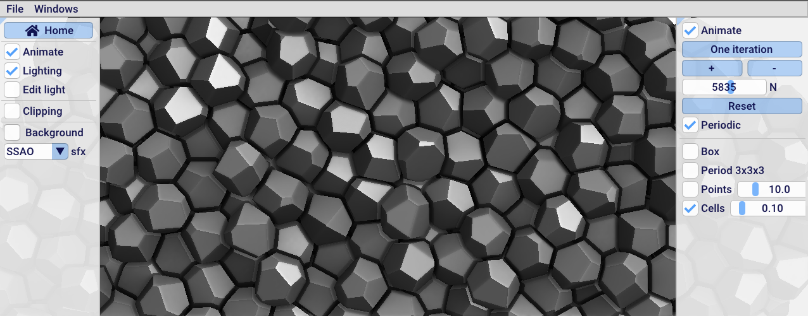

# 3D Delaunay triangulations and Voronoi diagram

The [example program](https://github.com/BrunoLevy/geogram/blob/main/src/examples/graphics/demo_Delaunay3d/main.cpp) 
computes a 2D Delaunay triangulation and the dual Voronoi diagram. Try
it [online](https://members.loria.fr/Bruno.Levy/GEOGRAM/geogram_demo_Delaunay3d.html).
The pointset can be optimized by Lloyd relaxation.

_WIP_