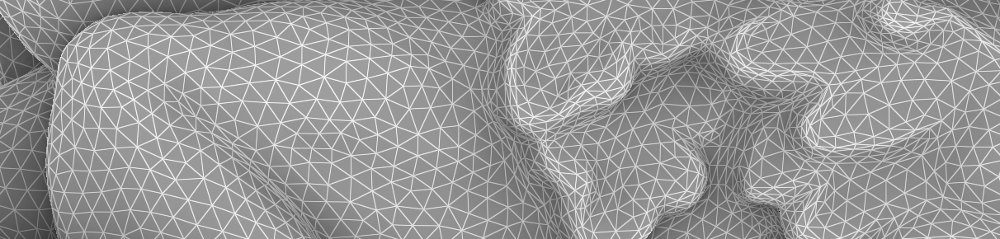

# Mesh data structure and attributes

Geogram as a general-purpose mesh data structure, that can represent
surfacic and volumetric meshes, with triangles or polygonal facets for
the surfacic part, and with tetrahedra, hexahedra, prisms and pyramids
for the volumetric part. 

Loading and saving a mesh
-------------------------

Triangulated and polygonal meshes
---------------------------------

Tetrahedralized and hybrid volumetric meshes
--------------------------------------------

Attributes
----------

Visualizing a mesh with Vorpaview
---------------------------------

_WIP_

